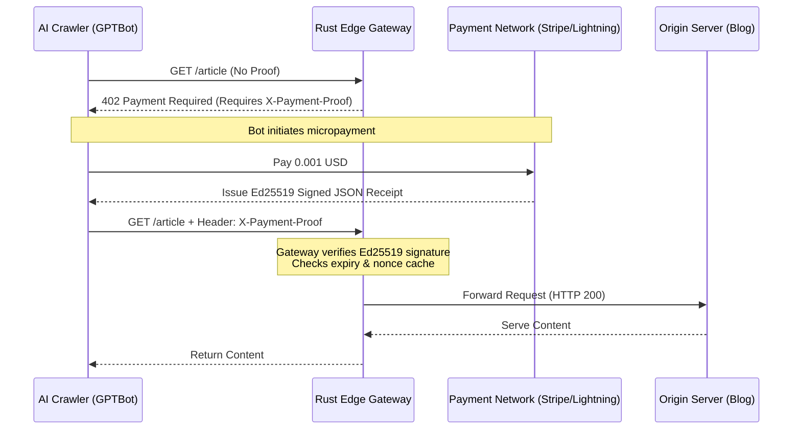
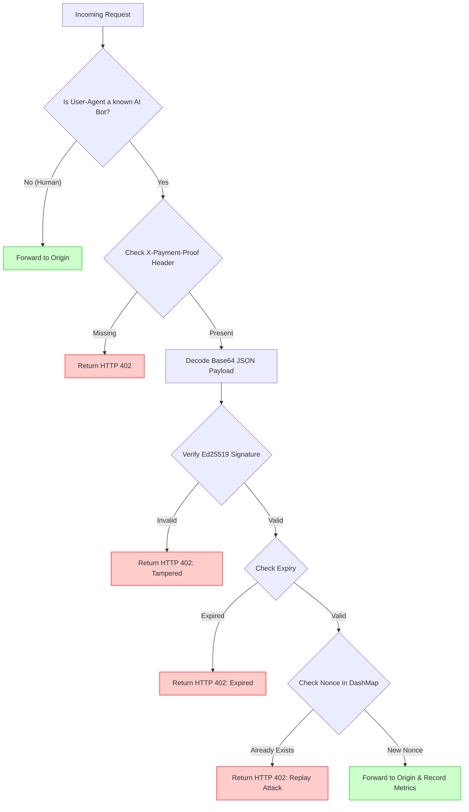

# PayPerCrawl Gateway: Marketing & Outreach Materials

Here is the complete package to promote your project. The diagrams are written in Mermaid (which Medium, GitHub, and Notion natively support), the article is structured to highlight your engineering depth, and the social posts are engineered to grab the attention of Cloudflare leadership.

---

## 📊 1. Diagrams for Medium

### Diagram 1: High-Level Architecture (The Pay-Per-Crawl Flow)
*Use this diagram early in the article to explain the core concept.*

### Diagram 2: Cryptographic Receipt Verification
*Use this when diving into the technical security details of your Rust implementation.*

---

## 📝 2. Medium Article Content

**Title:** Monetizing the AI Era: Building a Cryptographic Pay-Per-Crawl Edge Gateway in Rust

**Subtitle:** Why blocking AI crawlers is a losing battle, and how we can use edge computing and Ed25519 signatures to force them to pay for training data.

### Introduction
The web is facing a crisis. Massive AI companies are scraping the internet to train their LLMs, consuming exorbitant amounts of bandwidth and yielding zero return for the creators generating the data. 

The industry's current response is to update `robots.txt` or deploy WAF rules to block `GPTBot` or `ClaudeBot`. But blocking is a blunt instrument. What if, instead of blocking them, we **charged them**?

I built **PayPerCrawl Gateway**—a high-performance Rust reverse proxy designed to sit at the network edge. It intercepts AI crawler traffic and demands cryptographic proof of a micropayment before allowing access to the origin server. 

### The Architecture: Edge-Native Monetization
*(Insert Diagram 1 here)*

The premise is simple: human traffic passes through with zero latency overhead. However, if the proxy detects a known AI crawler, it halts the request and checks for an `X-Payment-Proof` header. 

If the bot hasn't paid, it receives an `HTTP 402 Payment Required` status code—a wildly underutilized HTTP standard built exactly for this future.

### Deep Dive: Cryptographic Verification at the Edge
To make this work without introducing massive latency, the gateway cannot query a centralized database for every single request. It needs to be stateless. 

*(Insert Diagram 2 here)*

Using **Tokio**, **Axum**, and **ed25519-dalek**, the gateway cryptographically verifies payment receipts in microseconds. 
1. **The Payload:** A JSON token containing the requested path, amount, timestamp, expiry, and a nonce.
2. **The Signature:** An Ed25519 signature generated by the payment provider (e.g., Stripe, Coinbase Commerce, or a Lightning Node).
3. **Replay Protection:** An incredibly fast, thread-safe in-memory `DashMap` cache records nonces to ensure a bot cannot reuse the same payment receipt twice.

### Built for Observability
Infrastructure is blind without metrics. I integrated Prometheus and Grafana directly into the middleware layer. With every request, the gateway logs `requests_blocked_total` and `payment_revenue_total`. For the first time, a website owner can look at a dashboard and see exactly how much revenue `GPTBot` generated for them today.

### The Cloudflare Opportunity
While I built this as a standalone Rust proxy running in Docker, its true home belongs at the edge. 

This entire architecture translates perfectly to **Cloudflare Workers**. Using Workers for the proxy execution, Ed25519 Web Crypto APIs for signature verification, and Cloudflare KV or Durable Objects for replay attack prevention, we could deploy this globally within milliseconds of the crawler.

If Cloudflare integrated a Pay-Per-Crawl mechanism into their WAF, it would fundamentally shift the economics of the AI internet overnight.

You can view the full source code and run the demo locally via Docker on my GitHub: [Link to your GitHub]

---

## 🐦 3. The "Hire Me" X (Twitter) Thread

*Tagging Cloudflare executives (Matthew Prince, John Graham-Cumming) and targeting infrastructure engineers.*

**Tweet 1 (The Hook):**
AI companies are scraping the web for free. Blocking them via robots.txt is a losing battle. The solution isn't blocking them—it's charging them. 

I built a Pay-Per-Crawl edge gateway in Rust that forces AI bots to cryptographically prove they paid for your data. 🧵👇
*(Attach a screenshot of the 402 Payment Required terminal output next to a successful 200 OK output)*

**Tweet 2:**
How it works:
1️⃣ Humans pass through instantly.
2️⃣ AI Bots (GPTBot, ClaudeBot) are intercepted.
3️⃣ Bots must provide an `X-Payment-Proof` header containing an Ed25519 signed receipt.
4️⃣ No payment? `HTTP 402 Payment Required`.

**Tweet 3:**
Performance is critical at the edge. 
Built on Axum + Tokio, the gateway verifies the cryptographic signature completely statelessly in microseconds. I used a thread-safe `DashMap` to cache nonces, completely neutralizing replay attacks. 
*(Attach Architecture Diagram)*

**Tweet 4:**
It's fully observable out of the box with Prometheus metrics tracking `bots_blocked` vs `micropayment_revenue`. 

This is currently a standalone Dockerized Rust proxy, but its true home is Serverless. 

**Tweet 5 (The Indirect Pitch):**
This exact architecture belongs in @Cloudflare Workers using KV/Durable Objects for nonce caching. Cloudflare has the power to flip the economics of the AI web overnight. 

With Cloudflare rapidly expanding its world-class engineering hubs in India 🇮🇳, I'm looking to join a team where I can build edge infrastructure at this exact scale. 

If any engineering leaders at @Cloudflare (or similar edge platforms) are expanding their India teams, my DMs are open. Let's build the future of the edge together. 

Code & Demo here: [Link to GitHub]

---

## 💬 4. Discord Message for the Cloudflare Community

*Post this in the `#workers` or `#showcase` channel in the official Cloudflare Developers Discord.*

> **Hey everyone! 👋**
> 
> I've been thinking a lot about how creators are losing out on AI crawlers scraping their data, so I built a proof-of-concept **Pay-Per-Crawl Edge Gateway** in Rust. 
> 
> Instead of blocking `GPTBot` or `ClaudeBot`, it intercepts them and returns an `HTTP 402 Payment Required` unless they provide an `X-Payment-Proof` header. The gateway then validates an Ed25519-signed payment receipt and uses a fast local cache to prevent replay attacks.
> 
> While I built this in Axum/Tokio, I'm currently looking into porting the entire logic to **Cloudflare Workers** using the Web Crypto API and KV for the nonce caching!
> 
> Would love to hear how the community here handles rogue AI crawlers, and if anyone has experimented with 402 Payment Required flows at the edge. 
> 
> Here's the GitHub repo if you want to test it locally via Docker: [Link to GitHub]
